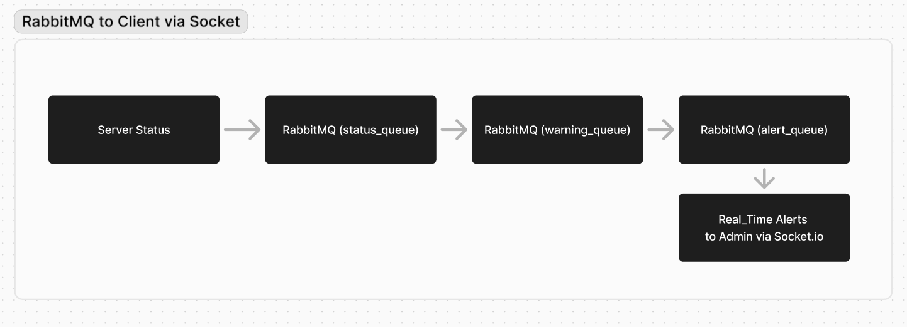

# Real-Time Server Monitoring and Alert System

This project demonstrates a real-time server monitoring system using RabbitMQ for backend message queuing and Socket.IO for real-time communication of alerts to administrators. The system checks server status, detects anomalies, and sends real-time alerts.

## Screenshot

## Business Process

1. **Server Status Check**:
   - Servers are periodically checked for their status (e.g., CPU usage, memory usage, disk space).

2. **Status Reporting**:
   - Each server sends its status data to RabbitMQ.

3. **Status Validation**:
   - A consumer reads the status data from RabbitMQ, validates it, and checks for anomalies.

4. **Anomaly Detection**:
   - If an anomaly is detected, a warning message is sent to the next queue for alert generation.

5. **Alert Generation**:
   - A consumer reads the warning messages and generates real-time alerts sent to administrators using Socket.IO.

